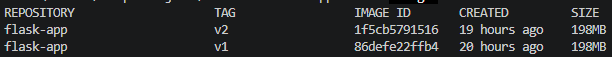
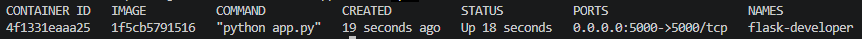
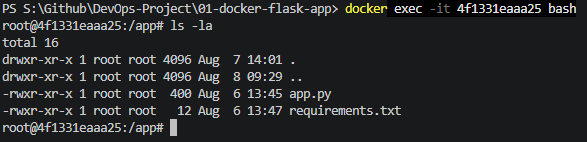
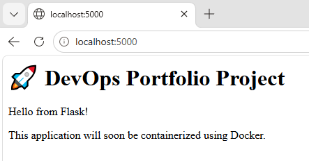

# 🚀 Project 1 - Dockerizing a Flask Application

This project is part of my DevOps learning journey.

The goal of this project was not just to containerize a Flask application, but to understand how Docker works internally, including Docker images, containers, Dockerfile instructions, caching, bind mounts, and volumes.

---

# 📌 Project Overview

In this project I learned how to:

- Create a Docker image
- Create and run Docker containers
- Write a Dockerfile from scratch
- Understand Docker layers
- Use Docker cache effectively
- Create a `.dockerignore`
- Understand Build Context
- Expose application ports
- Execute commands inside containers
- Understand the difference between Images and Containers
- Use Bind Mounts
- Understand Docker Volumes

---

# 🛠 Technologies Used

- Python 3.13
- Flask
- Docker
- Docker Desktop
- VS Code
- Git
- GitHub
- Windows PowerShell

---

# 📂 Project Structure

```text
01-docker-flask-app/
│
├── app.py
├── requirements.txt
├── Dockerfile
├── .dockerignore
├── README.md
└── screenshots/
```

---

# 🐳 Dockerfile

```dockerfile
FROM python:3.13-slim

WORKDIR /app

COPY requirements.txt .

RUN pip install -r requirements.txt

COPY . .

EXPOSE 5000

CMD ["python","app.py"]
```

---

# 📖 Understanding Each Dockerfile Instruction

| Instruction | Purpose |
|------------|---------|
| FROM | Uses Python 3.13 Slim as the base image |
| WORKDIR | Creates and sets `/app` as the working directory |
| COPY requirements.txt . | Copies dependency file first to improve Docker cache |
| RUN pip install | Installs Flask during image build |
| COPY . . | Copies application files into the image |
| EXPOSE 5000 | Documents that the application listens on port 5000 |
| CMD | Starts the Flask application when the container starts |

---

# 🏗 Build the Image

```bash
docker build -t flask-app:v1 .
```

This creates a Docker image named **flask-app** with tag **v1**.

---

# ▶ Run the Container

```bash
docker run -d -p 5000:5000 --name flask-container flask-app:v1
```

### Explanation

| Option | Meaning |
|---------|---------|
| -d | Run container in detached mode |
| -p | Publish container port to host |
| --name | Give the container a readable name |

---

# 🔍 Verify

```bash
docker ps
```

```bash
docker images
```

```bash
docker logs flask-container
```

---

# 💻 Enter the Running Container

```bash
docker exec -it flask-container bash
```

Useful commands:

```bash
pwd
ls -la
python --version
pip show flask
```

---

# 📂 Build Context

Docker uses the current directory as the build context.

```bash
docker build -t flask-app:v1 .
```

The final `.` tells Docker to use the current folder as the build context.

---

# 🚀 Docker Cache

Instead of copying the entire project first,

```dockerfile
COPY requirements.txt .
RUN pip install -r requirements.txt
COPY . .
```

allows Docker to reuse the dependency installation layer whenever only application code changes.

This makes builds much faster.

---

# 📄 .dockerignore

Used to reduce build context size.

Example:

```text
.git
.gitignore
Dockerfile
.dockerignore
__pycache__/
*.pyc
.venv/
.vscode/
screenshots/
README.md
```

---

# 📦 Images vs Containers

Docker Image

- Read-only template
- Created using `docker build`
- Can create multiple containers

Docker Container

- Running instance of an image
- Created using `docker run`

---

# 🔗 Bind Mounts

Example:

```bash
docker run -v "${PWD}:/app"
```

Bind mounts are useful during development because changes made on the host machine are immediately visible inside the container.

---

# 💾 Docker Volumes

Docker Volumes store persistent data outside the container.

They are commonly used for:

- PostgreSQL
- MySQL
- MongoDB
- Redis

Deleting the container does not delete the volume.

---

# 📚 Key Learnings

During this project I understood:

- Docker Images are blueprints.
- Containers are running instances of images.
- Containers have isolated file systems.
- Docker Build Context determines which files Docker can access.
- `.gitignore` and `.dockerignore` serve different purposes.
- Docker cache speeds up image builds.
- Bind mounts are best for development.
- Docker Volumes provide persistent storage.

---

# 📸 Screenshots

## Docker Images



## Running Container



## Docker Exec



## Browser Output




---

# 🚀 Future Improvements

- Add Docker Compose
- Add PostgreSQL
- Add Redis
- Add Nginx Reverse Proxy
- Deploy on AWS
- Kubernetes Deployment

---

# 👨‍💻 Author

Satyam Singh

This repository is part of my DevOps learning journey where I build projects from scratch while understanding every concept instead of simply following tutorials.